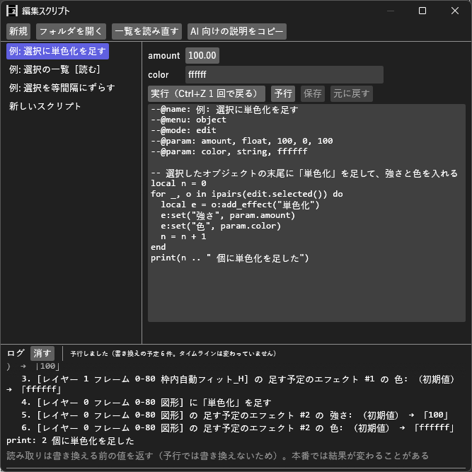

# EditScript_H マニュアル



**EditScript_H**（編集スクリプト）は、タイムラインを編集する短い Lua スクリプトを、パネルのボタンや右クリックメニューから実行するプラグイン（Rust 製 `.aux2`）です。
オブジェクトの作成・移動・設定値の変更・エフェクトの追加など、手作業だと何十回もクリックする編集を 1 本のスクリプトにまとめて、何度でも使えます。
**1 回の実行で行った書き換えは、Ctrl+Z 1 回でまとめて元に戻ります。**

- **バージョン:** 0.3.0（2026-10-10: 実行前に変えられる値を、Enter かほかをクリックしたときに確定し、入力中の Esc で入力する前の値に戻すようにした。0.2.1 で範囲が逆の param で止まらない・移動方法の確認を .tra2 から・値の数を中間点に合わせる。0.2.0 で予行を足した）
- **作者:** by HexBrowns
- **必要環境:** AviUtl2 **2.1.11** 以上

スクリプトを書けなくても、AI（Claude などのチャット）に書いてもらって使えます（下の「AI に書いてもらう」）。

---

## 開き方

- **表示** メニュー → **編集スクリプト**（ウィンドウ配置パネルからも選べます）
- オブジェクト・レイヤーの右クリックメニュー、編集メニューの **編集スクリプト** の下（メニューに出す設定のスクリプトだけ）

## 導入

1. [Releases](https://github.com/HexBrowns/EditScript_H/releases) から `HexBrowns.EditScript_H-v0.3.0.au2pkg.zip` をダウンロードし、AviUtl2 のプレビューへドラッグ&ドロップする
   （手で置くなら、中の `Plugin` フォルダをデータフォルダ `C:\ProgramData\aviutl2` へコピーする）
2. AviUtl2 を再起動する
3. **表示** メニュー → **編集スクリプト** でパネルを開く

導入されるもの:

| パス | 中身 |
|---|---|
| `Plugin\EditScript_H\EditScript_H.aux2` | プラグイン本体 |
| `Plugin\EditScript_H\API.md` | スクリプトの書き方（AI に渡す説明書と同じもの） |
| `Plugin\EditScript_H\scripts\` | スクリプトの置き場。最初は例が 3 本入っている |

---

## 画面の構成

| 位置 | 内容 |
|---|---|
| 上 | **新規**、**フォルダを開く**、**一覧を読み直す**、**AI 向けの説明をコピー** |
| 左 | スクリプトの一覧（読むだけのものには `[読む]` が付く。名前にマウスを乗せると、ファイル名とメニューの場所が出る） |
| 中央 | 実行前に変えられる値（スクリプトが持っているときだけ）、**実行** / **予行** / **保存** / **元に戻す**、本文 |
| 下 | ログ（実行の結果と `print` の出力）、**消す** |

## 使い方

### 例を動かしてみる

1. タイムラインでオブジェクトを 2〜3 個選ぶ
2. 左の一覧で **例: 選択の一覧** を選び、**読み取り** を押す → ログに位置とエフェクト名が出る
3. **例: 選択に単色化を足す** を選び、**実行（Ctrl+Z 1 回で戻る）** を押す → 選んだ全部に「単色化」が付く
4. Ctrl+Z を 1 回押すと、全部の単色化がまとめて消える

### 実行ボタンの表示

| 表示 | 意味 |
|---|---|
| **読み取り** | 読むだけ。タイムラインは変わらない |
| **実行（Ctrl+Z 1 回で戻る）** | 書き換える。まとめて 1 回の Undo になる |
| **実行（シーンの変更は Undo できません）** | シーンの設定（名前・サイズ・フレームレート）を変えるスクリプト。Ctrl+Z で戻らない |

### 予行（実行する前に確かめる）

書き換えるスクリプトには **予行** ボタンが出ます。押すと、タイムラインは変えずに「何をどう書き換えるか」の一覧がログに出ます。

```
△ 予行 例: 選択に単色化を足す: 書き換えの予定 6 件（タイムラインは変わっていない）
   1. [レイヤー 2 フレーム 0-119 テキスト] に「単色化」を足す
   2. [レイヤー 2 フレーム 0-119 テキスト] の 足す予定のエフェクト #1 の 強さ: （初期値） → 「100」
   …
```

- 設定値の書き換えは「今の値 → 新しい値」で出ます。レイヤーとフレームの番号は 0 から数えます
- 新しく作るオブジェクトの位置や設定を**読む**スクリプトは、その所で予行が止まります（まだ無いものは読めないため）。それまでの一覧は出ます
- 予行の結果がよければ **実行** を押してください

### 途中で止まったとき

途中でエラーになったときは、そこまでの書き換えが残ります。ログに出る案内どおり、Ctrl+Z 1 回でまとめて戻せます。

5 秒を超えたスクリプトは止まります（止まらないループ対策）。

### 値を変えて実行する

スクリプトが「実行前に変えられる値」を持っていると、本文の上に入力欄が出ます（例: **例: 選択を等間隔にずらす** の `step` = ずらすフレーム数）。
変えた値は右クリックメニューから実行したときにも使われます（AviUtl2 を終了すると初期値に戻ります）。

- 数値や文字の欄は、Enter かほかをクリックしたときに確定します。入力中に Esc を押すと、入力する前の値に戻ります
- 数値の欄は、ドラッグして変えることもできます（ドラッグで変えた値はその場で使われます）

### スクリプトを作る・直す

- **新規** で `新しいスクリプト.lua` ができ、本文が開きます。直したら **保存**
- **保存しなくても実行できます**（本文の欄の中身が走る）。右クリックメニューから走るのは保存した内容です
- **元に戻す** は、保存した内容に戻します
- 本文の欄では、Esc を押しても書いた内容は戻りません（欄から抜けるだけです）
- ファイルの名前を変える・消すときは **フォルダを開く** から行い、**一覧を読み直す** を押す
- **`例_` で始まるファイルは、プラグインの更新で上書きされます。** 例を直して使うときは、別の名前で保存してください

### 右クリックメニューに出す

本文の先頭に `--@menu: object` と書いて保存すると、**次に AviUtl2 を起動したとき**から、オブジェクトの右クリックメニューの **編集スクリプト** の下に出ます。

| 書き方 | 出る場所 |
|---|---|
| `--@menu: object` | オブジェクトの右クリックメニュー |
| `--@menu: layer` | レイヤーの右クリックメニュー |
| `--@menu: edit` | 編集メニュー |
| `--@menu: none` | 出さない（パネルからだけ実行） |

メニューに出すかどうかを変えたときだけ再起動が要ります。本文を直しただけなら再起動は要りません。

---

## AI に書いてもらう

1. 対象のオブジェクトを選んでおく
2. **AI 向けの説明をコピー** を押す（スクリプトの書き方と、今選んでいるオブジェクトの要約がクリップボードに入る）
3. Claude などのチャットに貼り付け、続けて「選択したテキストを 3 フレームずつずらして並べるスクリプトを書いて」のように頼む
4. 返ってきたコードを、**新規** で作ったスクリプトの本文に貼り付ける
5. **中身を見て**、**予行** で書き換えの一覧を確かめてから **実行** を押す。思った結果でなければ Ctrl+Z 1 回で戻し、ログに出たエラーをチャットに渡して直してもらう

AI が書いたコードは、自動では実行されません。

---

## スクリプトの書き方（要点）

詳しくは `Plugin\EditScript_H\API.md`。

```lua
--@name: 選択のXを100ずつずらす
--@menu: object
--@param: step, int, 100, -1000, 1000

for i, o in ipairs(edit.selected()) do
  local x = tonumber(o:get("標準描画", "X")) or 0
  o:set("標準描画", "X", x + param.step)
end
```

| 見出し | 意味 |
|---|---|
| `--@name: 名前` | 一覧とメニューに出る名前（省くとファイル名） |
| `--@menu: object / layer / edit / none` | 右クリックメニューに出す場所 |
| `--@mode: edit / read` | 書き換える（既定）/ 読むだけ |
| `--@param: 名前, 型, 初期値, 最小, 最大` | 実行前に変えられる値。型は `int` `float` `string` `bool`。本文からは `param.名前` で読む。最小が最大より大きいと見出しのエラーになります |
| `--@scene: true` | シーンの設定を変えてよい（Undo できない） |

- **レイヤーとフレームの番号は 0 から数えます。** 画面の「レイヤー 1」はスクリプトでは `0`
- 効果名・項目名は設定画面の表示名そのまま（`"標準描画"` の `"X"` など）。分からないときは `print(o:alias())` で全部の設定が見られます
- トラックバーを動かす値（`"0,50,100,直線移動,0"`）は、**数値の数をオブジェクトの点（開始・中間点・終了）の数に合わせます**（`#o:sections()` + 1）。合わない値は書かずに止めます（中間点無視と再生範囲は 2 つでよい）
- 動いているトラックに数値 1 つを書くと、移動なしになります（移動方法と中間点の値は消えます）

---

## 注意事項・制限

- 描画用のスクリプト（`.anm2` など）とは別物です。`obj.*` は使えません
- 使えるのは Lua の `string` `table` `math` `bit` と `print` だけです。ファイルの読み書き（`io`）や `os` は使えません
- 編集できるのは表示中のシーンだけです
- トラックバーの値に、本体に登録されていない移動方法を書こうとすると止まります（本体が編集を途中で打ち切るのを防ぐため）。使えるのは本体に組み込みのものと、`Script` フォルダの `.tra2` で起動時に読み込まれたものです。起動後に置いた `.tra2` は、AviUtl2 を再起動してから使ってください
- 出力中など、本体が編集を受け付けないときは実行できません（ログに出ます）
